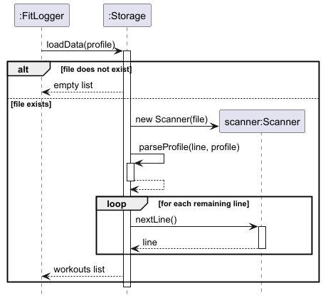
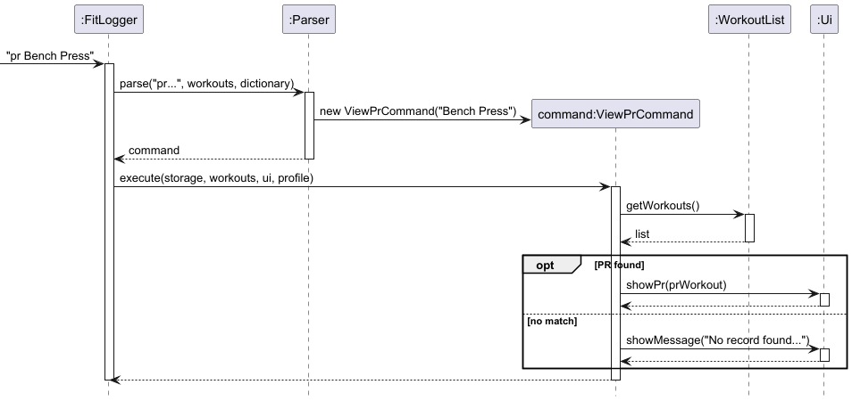

# wongeeshawn - Project Portfolio Page

---

## Overview

### Project: FitLogger

FitLogger is a desktop fitness tracking application for users who prefer a CLI. It allows
users to log strength and running workouts, track personal records, and manage a profile —
all from the command line.

---

## Summary of Contributions

### Code contributed

[Code Dashboard](https://nus-cs2113-ay2526-s2.github.io/tp-dashboard/?search=wongeeshawn&breakdown=true)

### Enhancements implemented

#### Enhancement 1: `Storage` — `saveData()` and `loadData()`

Designed and implemented the full persistence layer for FitLogger, enabling workout data
and user profiles to survive between sessions.

**`saveData(List<Workout> workouts, UserProfile profile)`**
- Automatically creates the `data/` directory if it does not exist, using a checked
  `mkdirs()` call whose return value is explicitly handled.
- Writes the user profile as the first line of the file using `profile.toFileFormat()`.
- Loops through the entire `WorkoutList`, calling `toFileFormat()` on each `Workout`
  and writing it line-by-line via `FileWriter` in a try-with-resources block.
- Includes an `assert workouts != null` guard as a defensive sanity check.
- Gracefully handles `IOException` with an error message rather than crashing.

**`loadData(UserProfile profile)`**
- Returns an empty list silently on first run if the file does not exist — no crash,
  no error message shown to the user.
- Reads line 1 as the user profile via `parseProfile(line, profile)`.
- Dispatches each subsequent line by type prefix: `R` → `parseRunWorkout(fields)`,
  `L` → `parseStrengthWorkout(fields)`.
- Each field is parsed defensively: dates via `LocalDate.parse()`, doubles via
  `Double.parseDouble()`, and integers via `Integer.parseInt()` — each in its own
  try-catch with a descriptive error message.
- Corrupted or unrecognised lines are skipped with a warning rather than aborting
  the entire load, preserving all valid data above and below the corrupted entry.

This was a non-trivial feature to implement correctly because it required coordinating
with the `Workout` class hierarchy (both `RunWorkout` and `StrengthWorkout` needed
correct field counts and index constants), the `UserProfile` persistence format, and
the storage delimiter rules enforced by the `Parser`.

#### Enhancement 2: `ViewLastLiftCommand`

Implemented a command that retrieves the most recent strength workout for a given
exercise name, searched in reverse chronological order.

- Searches `WorkoutList` from the last index downward, stopping at the first
  `StrengthWorkout` whose description matches the target exercise ID
  (case-insensitive).
- Calls `ui.showLastLift(lift)` to display date, weight, sets, and reps.
- Added `showLastLift(StrengthWorkout lift)` to the `Ui` class.
- Includes two `assert` statements for null-safety.
- Wired into `Parser` via the `lastlift` command keyword.

Reverse-order search was a deliberate design choice — it finds the most recent
match without scanning the entire list, making it efficient for large workout
histories.

#### Enhancement 3: `ViewPrCommand`

Implemented a command that finds and displays a user's personal record for a
specific exercise — the highest weight for a strength exercise, or the longest
distance for a run exercise.

- Scans the entire `WorkoutList` to find the entry with the maximum value for
  the given exercise name.
- For `StrengthWorkout` entries, tracks the highest `getWeight()`.
- For `RunWorkout` entries, tracks the longest `getDistance()`.
- Calls `ui.showPr(prWorkout)` to display the result.
- Added `showPr(Workout workout)` to the `Ui` class.
- Wired into `Parser` via the `pr` command keyword.

A full linear scan (rather than stopping early) was chosen intentionally because
the PR requires comparing all entries — unlike `lastlift` which stops at the
first match.

---

### Contributions to the User Guide

Wrote the following sections:

- **Viewing your last lift: `lastlift`**
- **Viewing your personal record: `pr`**
- **Saving and loading your data**
- Added `lastlift` and `pr` rows to the Command Summary table

---

### Contributions to the Developer Guide

Wrote the following sections:

- **Enhancement 10: `Storage` — `saveData()` and `loadData()`**: design overview,
  step-by-step behavior for both methods, storage file format, and design
  considerations with alternatives discussed.
- **Enhancement 11: `ViewLastLiftCommand`**: class-level design, sequence of events,
  and design considerations covering search direction and match criteria.
- **Enhancement 12: `ViewPrCommand`**: class-level design, sequence of events, and
  design considerations covering scan strategy and PR metric per workout type.

**UML diagrams contributed:**

| Diagram | Type |
|---|---|
| `SaveDataSequenceDiagram` | Sequence |
| `LoadDataSequenceDiagram` | Sequence |
| `ViewLastLiftClassDiagram` | Class |
| `ViewLastLiftSequenceDiagram` | Sequence |
| `ViewPrClassDiagram` | Class |
| `ViewPrSequenceDiagram` | Sequence |

---

### Contributions to team-based tasks

- [Pull Requests authored](https://github.com/AY2526S2-CS2113-F09-1/tp/pulls?q=is%3Apr+author%3Awongeeshawn)

---

## Contributions to the Developer Guide (Extracts)

### Enhancement: `Storage` — `saveData()` and `loadData()`

#### Purpose and user value
`Storage` persists workout data between sessions. `saveData()` writes all workouts
to disk on exit so no data is lost. `loadData()` reconstructs the workout list on
startup so users resume exactly where they left off.

#### loadData() — Sequence of events

`loadData()` checks if the file exists first — returning an empty list silently on
first run. It then reads the profile from line 1, dispatches each workout line by
type prefix (`R` or `L`), and skips corrupted lines with a warning rather than
aborting the load.

---

### Enhancement: `ViewLastLiftCommand`

#### Purpose and user value
`ViewLastLiftCommand` lets users instantly retrieve the most recent stats for a
specific lift exercise without scrolling through their full history.

#### Sequence of events

The command loops from the last index downward, stopping at the first matching
`StrengthWorkout` and calling `ui.showLastLift(lift)`. If no match is found,
a not-found message is shown.

---

### Enhancement: `ViewPrCommand`

#### Purpose and user value
`ViewPrCommand` finds and displays a user's personal record for a specific exercise —
highest weight for strength, longest distance for runs.

#### Sequence of events

The command scans the entire list, tracking the entry with the maximum value for
the given exercise. The result is passed to `ui.showPr(prWorkout)` for display
